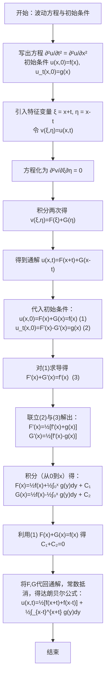

---
tags:
  - Fourier_Analysis
---
>这本书 Fourier Analysis An Introduction.Stein 将作为我们讨论班的教材 . 不过很可惜的是，似乎我们学校对这方面的发展有些漠不关心，以至于我一直找不到什么同道人（就连试试的都没有) . 找到的好像又过于超前了——已经入学快两年了 . 我感觉我可以先看看，整理整理，怎么说是要学的，怎么说是要去追一下 . 对我而言，数学可能已经是过去日子里的一大遗憾，遗憾就让其成为遗憾吧 .

这本书的作者了不得啊，对数学不了解的人可能不清楚 Stein 是谁，但是我谈起陶哲轩，大概知道的人就多一些了. Stein 何许人也？Tao 之恩师也！在世图的前言里面，已经吹过这本书了 “但其中有一句叫 - '**都买得起这本书**'” 我感觉是有些过了，绝版后书的价格飙升到将近100人民币！

不过这里感谢有学长引路！不胜感激 

Fourier Analysis An Introduction.实际上是一门学科应用性和知识串联度很高的一本书，案例来自某高校物理系同学聊天时的记录（不过当时应该看的不是物理的教材）。

![[Screenshot_20260214_010321_com.tencent.mm.png]]

不用等 Stein 说，我就已经感受到了 Fourier 分析如何决定和影响其他领域了 .

好，我们开始学习这本书。

# The beginning of the story

故事的最初来自我们的熟悉的弹簧振子 —— 我们在高中时就会出现一些简谐振动的问题 . 这类问题和我们未接触过的热流（Heat Flow）将由两个不同的偏微分方程（波动方程和热传导方程）进行解答，这些方程便是通过傅里叶级数（Fourier series）求解的。
```tikz
\usepackage{pgfplots}
\usepackage{amsmath}
\pgfplotsset{compat=1.16}

\begin{document}

% ---------- Wave equation (vibration) illustration ----------
\begin{tikzpicture}[domain=0:6.28, scale=1.2]
    \draw[very thin, color=gray!30] (0,-1.5) grid (6.5,1.5);
    \draw[->] (-0.2,0) -- (6.8,0) node[right] {$x$};
    \draw[->] (0,-1.8) -- (0,1.8) node[above] {$u(x,t)$};
    \draw[color=red, thick] plot (\x, {sin(deg(\x))}) node[right] {$u(x,t_1)$};
    \draw[color=blue, dashed, thick] plot (\x, {0.7*sin(deg(\x-1.5))}) node[above right] {$u(x,t_2)$};
    \draw[color=green!70!black, dotted, thick] plot (\x, {0.5*sin(deg(\x+1.2))}) node[below left] {$u(x,t_3)$};
    \node[draw, fill=white] at (3.2,1.5) {Wave equation: $u_{tt}=c^2u_{xx}$};
\end{tikzpicture}
\hspace{0.8cm}
% ---------- Heat equation illustration (infinite plate) ----------
\begin{tikzpicture}
    \begin{axis}[
        width=8cm,
        colormap/viridis,
        colorbar,
        colorbar style={label=$u$},
        xlabel=$x$,
        ylabel=$y$,
        zlabel={$u(x,y,t)$},
        title={Heat distribution at fixed $t$},
        domain=-2.5:2.5,
        view={60}{30},
        samples=21,
        grid=major,
        grid style={dashed, gray!30}
    ]
    \addplot3[surf, shader=flat] {exp(-x^2 - y^2)};
    \end{axis}
\end{tikzpicture}

\end{document}
```
<center>图片来自Deepseek帮助的 Tikz 绘图</center>

## A Vibrating String

在高中时候，我们就已经学习过简单的机械振动。我们通常会计算波的叠加，何处加强，何处减弱，甚至在一些比较难的试卷上会出现一些比较难的理念像什么半波损失啊吧啊吧。![[屏幕截图 2026-02-14 140018.png]]
<center>——对，这道题其实也可以是分析波——</center>
高中时做的题目现在已经找不到了，现在找题发现了不少很有趣的问题。不过好在我现在不用做题，所以盯题也成了人生一大趣事啊。

我们两端固定 (fixed at) 的弦在力的作用下会产生振动，某些在一定频率内的振动则会被我们的大脑处理，从而感知声音。我们研究弦振动从以下的可观测物理现象入手：
- 简谐运动 (Simple Harmonic Motion)
- 驻波和行波 (Standing and Traveling Waves)
- 谐波-和声以及波的叠加 (Harmonics and Superposition of Tones)
通过直观的物理现象来窥见背后的数学原理

### Simple Harmonic Motion

简谐运动是我们高中课内学习的知识，当时的简谐运动还很纯粹，就像下面这张图

```tikz
\usepackage{tikz}
\usetikzlibrary{decorations.pathmorphing, patterns, arrows.meta}
\begin{document}
\begin{tikzpicture}
  % 墙壁（剖面线表示固定端）
  \fill[pattern=north east lines] (0,0.5) rectangle (0.2,2);
  \draw[thick] (0.2,0.5) -- (0.2,2);
  % 地面
  \draw (0,0.5) -- (6,0.5);

  % 几何参数
  \def\wallX{0.2}          % 墙壁右端x坐标
  \def\massLeft{4}         % 滑块左侧x坐标
  \def\massWidth{1}        % 滑块宽度
  \def\massHeight{1.2}     % 滑块高度
  \def\massY{0.5}          % 滑块底部y坐标（与地面接触）
  \def\springY{1.1}        % 弹簧连接点y坐标（滑块侧面中点）

  % 弹簧（从墙壁到滑块左侧）
  \draw[decorate, decoration={coil, aspect=0.4, segment length=0.4cm, amplitude=0.25cm}]
    (\wallX, \springY) -- (\massLeft, \springY);

  % 滑块（白色填充，黑色边框）
  \fill[white] (\massLeft, \massY) rectangle (\massLeft+\massWidth, \massY+\massHeight);
  \draw[thick] (\massLeft, \massY) rectangle (\massLeft+\massWidth, \massY+\massHeight);
  \node at (\massLeft+0.5, \massY+0.6) {$m$};   % 质量标签

  % 弹簧劲度系数标签
  \node at (2, 1.8) {$k$};

  % 水平坐标轴
  \draw[->] (0, 2.8) -- (6, 2.8) node[right] {$y$};

  % 平衡位置（滑块中心）
  \def\centerX{\massLeft+0.5}
  \draw[dashed] (\centerX, 2.8) -- (\centerX, 0.5);
  \node at (\centerX, 3.0) {$0$};

  % 位移正方向指示
  \draw[->, thick] (\centerX, 2.5) -- (\centerX+1.5, 2.5) node[midway, above] {$x$};
\end{tikzpicture}
\end{document}
```

当我们将物块 $m$ 移动到非静止点，假设这段摩擦系数为 $0$ . 我们根据胡克定律，可以得到 $F=-k x$ .其实我们已经知道了这样的运动为简谐运动，并且公式中的 $k$ 我们称之为弹性系数 ($Spring\ constant$) . 根据牛顿第二定律 $F=ma$ , 我们能得到 
$$-ky(t)=my''(t)\ ,$$
如果我们高中的时候没有了解过路程 ( $s$ )，速度 ( $v$ ) ，加速度 ( $a$ ) 和时间 ( $t$ ) 函数之间的关系，可能会对这个关系有些陌生，这里可以简单推一下 .  
$$\begin{align*}
& s= \frac{1}{2} at^2\\
& v=at=s'(t) \\
& a=a=v'(t)=s''(t)
\end{align*}$$
此时我们令 $c=\sqrt{\frac{k}{m} }$  ，此时可以化为 
$$y''(t)+c^2 y(t)=0 \tag{1}$$
这是一个二阶常微分方程，这里我们插入一下常微分方程的概念：

>  常微分方程：是把“未知的函数”、“它的变化率（导数）”以及“自变量”联系起来的等式。对于其求解，我们可以采用反向求导（微积分）的方法 —— 来得出我们想要的“未知函数” —— 当然这样求解的肯定是一些比较简单方程。此处我们全当稍作了解 .

对于 $(1)$ 式，其通解为 
$$y(t)=a\cos ct+b\sin ct$$
其中 $a\ ,\ b$ 为常数，这个正向求解有些困难，但是反向证明不难。当我们知道这个运动的初始位置和速度时，此时解是唯一的，即 
$$y(t)=y(0)\cos ct+\frac{y'(0)}{c}\sin ct$$
根据早已知晓的两角和差公式，我们可以知道上述通解能化为一个式子 
$$a\cos ct+b\sin ct=A\cos(ct-\varphi)$$
-  $A=\sqrt{ a^2+b^2 }$  称之为 **振幅** ( $Amplitude$ ) 
-  $c$ 称之为 **频率** ，或称为 固有频率 ( $Natural\ frequency$ ) $\frac{2\pi}{c}$ 就是我们知道的周期
-  $\varphi$ 为 **相位** ( $phase$ ) ，这里中文翻译非常直观，即 “位置的相”

这个式子就可以解释我们的振动方程的特性，我们的振动方程呈现出波动的状态，由 $\cos t$ 的平移变化，拉伸变化而来。这种运动我们就称为简谐运动：对于简谐运动的分析，我们以后要有这几点要注意一下：
1. 三角函数和复数之间的关系：欧拉公式 $e^{it}=\cos t+i\sin t$ 
2. 简谐运动由初始位置和速度确定
对于一个一般的振动系统，我们同样有类似的性质

### Standing and Traveling Waves

我们或将弦振动抽象为一维的波动变化，用两种波特定的波对弦振动进行描述：
- 驻波 ( $Standing\ Waves$ )
- 行波 ( $Traveling\ Waves$ )
顾名思义，就是以一种运动状态来进行分类，下面我们对这两种波进行讨论。

```tikz
\usepackage{tikz}
\begin{document}
\begin{tikzpicture}[scale=0.9, every node/.style={font=\small}]
  % ---------- left: traveling wave ----------
  \begin{scope}[xshift=0cm]
    % axes
    \draw[->] (0,0) -- (6.8,0) node[right] {$x$};
    \draw[->] (0,-1.5) -- (0,1.8) node[above] {$y$};
    \draw[very thin, gray!50] (0,-1) grid (6.5,1);
    % two snapshots (t=0 and t=Δt) with bright colors
    \draw[domain=0:6.2832, samples=100, smooth, cyan, thick] plot (\x, {sin(\x r)}) node[right] {$t=0$};
    % direction arrow
    \draw[->, thick] (1.57, 1.3) -- (2.8, 1.3) node[midway, above] {direction};
    % title
    \node at (3.3,1.8) {\textbf{Traveling Wave}};
  \end{scope}

  % ---------- right: standing wave ----------
  \begin{scope}[xshift=8cm]
    % axes
    \draw[->] (0,0) -- (6.8,0) node[right] {$x$};
    \draw[->] (0,-1.5) -- (0,1.8) node[above] {$y$};
    \draw[very thin, gray!50] (0,-1) grid (6.5,1);
    
    % standing wave at three different times
    % t = 0 (max amplitude) - bright blue
    \draw[domain=0:6.2832, samples=100, smooth, blue!50!white, thick] plot (\x, {sin(\x r)});
    % t = T/6 (smaller amplitude) - bright orange
    \draw[domain=0:6.2832, samples=100, smooth, orange!90!white, dashed] plot (\x, {0.5*sin(\x r)});
    % t = T/3 (even smaller) - bright green
    \draw[domain=0:6.2832, samples=100, smooth, green!90!black, dotted] plot (\x, {0.2*sin(\x r)});
    
    % nodes (N) – positions where sin(kx)=0
    \foreach \x in {0, 3.1416, 6.2832}{
      \filldraw[white] (\x,0) circle (1.5pt) node[below, text=white] {N};
    }
    % antinodes (AN) – positions where sin(kx)=±1
    \filldraw[white] (1.5708, {sin(1.5708 r)}) circle (1.5pt) node[above, text=white] {AN};
    \filldraw[white] (4.7124, {sin(4.7124 r)}) circle (1.5pt) node[below, text=white] {AN};
    
    % Labels for each time placed at distinct positions on the curves
    % t=0 label at first peak (x=1.57, y=1)
    \node[blue!50!white] at (1.57, 1.2) {$t=0$};
    % t=T/6 label at second peak (x=4.71, y=0.5) shifted downward
    \node[orange!90!white] at (4.71,0.2) {$t=T/6$};
    % t=T/3 label at first peak (x=1.57, y=0.2) shifted upward but avoid overlap with t=0 label
    \node[green!60!white] at (2.2, 0.4) {$t=T/3$};
    % Optionally draw small circles at these positions for clarity
    \filldraw[blue!50!white] (1.57,1) circle (1pt);
    \filldraw[orange!90!white] (4.71,-0.5) circle (1pt);
    \filldraw[green!90!black] (1.57,0.2) circle (1pt);
    
    % title
    \node at (3.3,1.8) {\textbf{Standing Wave}};
  \end{scope}
\end{tikzpicture}
\end{document}
```

**What is Standing \Traveling Waves?** 

如果我们波动琴弦，那么它将振动从而发出声音，我们凑近观察，琴弦上的一个点，他将在弦上~~翻花~~（bushi），呈现出山下振动的形态，这样的的振动并不会出现视觉上的 "位移" ，我们变称其为 **驻波**
对于一个初始的图形 $\varPhi(x)$ 此时就记为当 $t=0$ 时的图形，我们可以看上图的 $t=0$ 的状态 . 我们可以再定义一个函数 $\psi(t)$ 来控制其缩放, 这个函数与时间 $t$ 有关 . 我们就得到最终的表达式 
$$y=\varPhi(x)\psi(t)$$
这是一个关于 $x,t$ 的函数，我们也可以表示为 
$$y=u(x,t)=\varPhi(x)\psi(t)$$
这个思想被称为 "分离变量法" ( $Sepaeation\ of\ Variable$ ) , **据说在后续会复现** 

但是如果我们想要记录琴弦的振动，我们如果用手机在一些特定的光照环境下拍摄，可能就发现了琴弦上的 "波" 好像在朝着某个方向移动，这种由果冻效应或者快门速度造成的可观测现象我们可以称为 **行波** 
![[Pasted image 20260217161956.png]]
类似我们示意图的左图，一段波向着一个方向移动 . 我们可以直接从函数的角度思考这个函数的组成，在函数中我们如果要让一个图形出现平移变化，通常会选择直接在 $x$ 上做文章 。有一首古老的歌这样唱到  "左~加~右~减~" , 我们可以这样描述。
对于一个函数 $F(x)$ , 我们定义一个函数 $\phi(t)=ct$ 这是一个关于 $t$ 的函数，我们就能这样来描述这个运动的变化 
$$y=u(x,t)=F(x\pm\phi(t))=F(x\pm ct)$$
这里的 $\pm$ 就是波移动的方向。

### Harmonics and Superposition of Tones

看到这里，恭喜大家完成对高中物理和数学知识的复习，我们将进入一些相对复杂的计算和相对难理解的理论。
我们一般人都知道的是，不同的乐器具有不用的音色，对于同一个音符，我们用钢琴演奏，同管吹奏，同提琴拉奏所得到的听感是不同的。我们通过音色来判断一个曲子中用了什么乐器。一般人可能不知道的是，我们将多个不同的音组合可以叠加出一类特别的声音，他几乎是改变了一个音的感觉！这类声音让原来的一个音表现得更加厚，或者更加薄（这样得描述好抽象）

![[Pasted image 20260217185046.png]]

上面得研究我们知道，我们研究的震荡系统其实是由两给变量决定，为了得到我们的原函数，就不只是常微分方程那么简单了，我们将引入偏导数和偏微分方程的概念 （简单理解可）方便我们后续的研究.

-  **偏导数** ( $Partial\ Perivative$ )
我们已经了解的导数的概念，它表示变量 $x$ 对因变量的 $y$ 的影响程度。我们现在的 $y$ 受到了两个因素的影响，为了只研究其中一个因素对 $y$ 的影响，我们变有了偏导数 。这里的偏，意味着不完全。我们对偏导数的求解可以这样简单地理解 ：
1. 确定元素
2. 将不求解地元素视为常数
3. 按照求导规则求导

下面给出示例： 函数 $g(x,y)=e^x \cdot \sin y$ ，求 :
1. 
   $$\frac{{\partial g}}{\partial x}$$
2. 
   $$\frac{{\partial g}}{\partial y}$$
解：
   对于 1. 我们将 $\sin y$ 视为常数 $C$ 那么就是求 
$$g'(x)=e^x\cdot C$$
结果就是 
$$\frac{{\partial g}}{\partial x}=e^x \cdot \sin y$$
   对于 2. 我们将 $e^x$ 视为常数 $C$ 那么就是求 
$$g'(y)=C \cdot \cos y$$
于是得到 
$$\frac{{\partial g}}{\partial y}=e^x\cdot\cos y$$
- **偏微分方程** ( $PDE$ )
和常微分方程一样，我们解偏微分方程也是为了得到得到的原方程。我们就将求解啥的留在后头吧。

#### Derivation of The Wave Equation 

我们在此对一维振动方程进行推导，这里很感谢 maki 粉丝群的一位群友为我解释其中的物理原理！

我们先想像我们有一根材质均匀的细绳，其固定在 $(x,y)$ 平面上——我们认定其在 $x=0$ 到 $x=L$ 固定且绷紧。我们要解一维波动方程要先了解一个点的运动，此时我们要将这个绳子子看成由 $N$ 个粒子平均分配在细绳上且能够相互作用的系统。如此，我们第 $n$ 个粒子在 $x$ 轴上的坐标就能表示成 $x_{n}=n \frac{L}{N}$ .

此处，我们要引进一个老生常谈的问题，一个单摆系统摆起来就会是简谐运动了吗？答案是显然的，我们曾经强调过要小角度摆动 . 在此处，我们要假设这个系统只是进行微小的振动，那么我们可以简单证明如下假设：( 逻辑不分先后 )

- 每个粒子仅在垂直方向上运动
- 每个粒子的受力仅受到相邻粒子的影响（影响成正比，且比值为 $\frac{d{(y_{n-1},y_{n})}}{h}$）
- 忽略相对长度的变化量 ( 张力常数不变 )

并且补充以下假设：
- 弦的密度恒定为 $\rho>0$ ，那么每个粒子可以视为质量为 $\rho h$

现在我们进行分析：

我们先设一个函数 $y_{n}(t)=u(x_{n},t)$ , 这表示这条弦上质点的振动情况。我们已经将弦分成了 $N$ 段，那么相邻两个粒子之间的距离就是 $h=\frac{L}{N}$ . 由假设每个粒子的受力仅受到相邻粒子的影响，我们简化计算，影响成正比，且比值为 $\frac{{y_{n-1}-y_{n}}}{h}$ . 根据牛顿第二定律，作用在第 $n$ 个粒子上的力为 
$$phy''(t)$$
根据分析，我们单个粒子的受到左右两边的粒子影响，分别受力为 : 
$$\left( \frac{\tau}{h} \right)(y_{n+1}-y_{n})\ ,\quad \left( \frac{\tau}{h} \right)(y_{n-1}-y_{n})$$
这里的 $\tau$ 为我们设置的一个张力系数，且 $\tau>0$ .  

该质点受到的了合力可以这样表示 (  此前的假设表明张力和和力作用在垂直方向上  )
$$phy''(t)=\left( \frac{\tau}{h} \right)(y_{n+1}+y_{n-1}-2y_{n})$$
其中，括号内可以表示为 
$$y_{n+1}+y_{n-1}-2y_{n}=u(x_{n}+h,t)+u(x_{n}-h,t)-2u(x_{n},t)$$
此外，对于任意二阶可导函数 $F(x)$ ,当 $h$ 趋向于 $0$ 时，我们有 ( $Lagrange$ 中值定理 )
$$\frac{{F(x+h)+F(x-h)-2F(x)}}{h^2}\to F''(x)$$
我们对 $(2)$ 式进行处理，并且令 $h\to {0}$ ( 或 $N \to \infty$ ）我们可以得到 
$$\rho  \frac{{\partial^2 u}}{\partial t^2}=\tau  \frac{{\partial^2u}}{\partial x^2}$$
或者我们根据上文令 $c=\sqrt{ \frac{\tau}{\rho} }$ , 得到 
$$\frac{1}{c^2}  \frac{{\partial^2 u}}{\partial t^2}= \frac{{\partial^2u}}{\partial x^2}$$
这个方程就称为**一维波动方程**或者**波动方程** , 就此处的 $c>0$ 又称之为速度我们将在后文解释。 

对于这个偏微分方程，我们可以采用换元法进行简化。对于 $x$ , 令 $a$ 为一个正常数，我们有 $x=aX$ ——此时 $X$ 的区间为 $\left[ 0, \frac{L}{a} \right]$ ;对于 $t$ , 令 $b$ 为一个正常数，我们有 $t=bT$ . 如此我们有 $u(x,t)=U(X,T)$ . 此时我们适当选取 $a$ 与 $b$ 的值 ，就能把一维波动方程转化为 
$$\frac{{\partial^2U}}{\partial T^2}=\frac{\partial^2U}{\partial X^2}$$
其最直观的效果就是我们的速度 $c=1$ . 此外，我们可以自由地将 $x$ 范围限定为 $[0,\pi]$ . 只要我们解出了这个方程就能进行逆变化变回原始方程，这样我们简化的方程同样不失一般性 . 

#### Solution to The Wave Equation

很好，现在我们已经清楚了振动弦方程，现在我们要在之前提到的两类波的形式求解：
- 利用行波进行求解
- 运用驻波的叠加进行求解
下面这段话我翻译一下原文，作者写得有些搞：
第一种方法非常简单且**优雅**（elegant），但是并没有直接帮助我们洞察问题 ；第二种方法做到了帮我们洞察问题，并且应用性更加宽泛。起初人们认为第二种方法仅仅适用于简单得情况——弦的初始位置和速度本身被表示为驻波叠加的情况。但是（However），作为傅里叶的思想结晶，我们的问题**显然**（became clear）可以通过任何一种方式解决。

这里的意思呢就是说：用行波法解很快很简单，但是我对波本身的情况不清楚。用驻波法呢，早期人类又显得有些幼稚，认为初始形状要是不规则（不像波-波浪）就认为这种方法遇到瓶颈了。现在呢，傅里叶来了，青天就有了！
##### Traveling Wave

我们利用此前的操作，此处将波动方程化为
$$\frac{{\partial^2 u}}{\partial t^2}=\frac{{\partial^2u}}{\partial x^2}$$
这个方程是具有一般性的，且 $x$ 的范围是 $[0,\pi]$ 并且 $t>0$ . 注意，下面的环节需要集中注意力 （$attention\ is\ all\ you\ need$）.
我们敏锐地注意到 , 若 $F$ 是任意二阶可微方程，那么实际上对于方程 $u(x,t)=F(x+t)$ 或者 $u(x,t)=F(x-t)$ 都是该方程的解。这里相对比较好理解，因为我们基本都接触过左加右减的一个说法，这里解这个波动方程就能理解为 $F$ 在 $x$ 方向上进行左右传播的一个函数。并且由我们之前的设定，这个传播速度为 $1$ .

我们在上文的讨论中知晓了，波函数是线性的 ( $linear$ ) ，即对于两个不同的为特解的方程 $u(x,t)$ 和 $v(x,t)$ 成立：对任意 $\alpha$ , $\beta$ , 有 $\alpha u(x,t)+\beta v(x,t)$ 表示该微分方程的任意解。对于本话题，就有理由进行以下操作：
- 找到两个反方向传播的波 $F(x+t)$ 和 $G(x-t)$ （二次可微） . 易知 $u(x,t)=F(x+t)+G(x-t)$
- 证明我们的易知结果即解的一般形式

proof. 我们暂时忽略 $x\in[0,\pi]$ 的这个假设，并且设 $u(x,t)$ 二阶可微且对微分方程满足任意实数 $x$ 与 $t$
我们令 $\xi= x+t$ , $\eta=x-t$ . 新定义 $v(\xi,\eta)=u(x,t)$ . 于是振动方程可以这样表示 
$$\frac{\partial^2v}{\partial \xi \partial \eta}=0$$
我们二次积分这个式子可以得到 $v(\xi,\eta)=F(x+t)+G(x-t)$ , 从而有 
$$u(x,t)=F(x+t)+G(x-t)$$
自此，我们先回到原来的应该要有的条件——限定 $x\in [0,\pi]$ 、初始形状为 $u(x,0)=f(x)$ 、弦两端固定。 那么对所有 $t$ 有 $u(0,t)=(\pi,t)=0$ . 为了利用我们已经发现的结论，我们首先要将定义域扩展到整个 $\mathbb{R}$ —— 通过复制粘贴的方式来覆盖整个 $x$ 轴 . 我们首先将 $f$ 变为 $[-\pi,\pi]$ 的奇函数 (make it **odd**) 然后再让其成为一个周期函数 . 所有 $u(x,0)=f(x)$ 因此 $u(x,t)=F(x+t)+G(x-t)$ , 我们让 $t=0$ 后就有 
$$F(x)+G(x)=f(x)$$
由于众多的 $F$ 和 $G$ 都符合这个等式，我们要对 $u(x,t)$ 进行初始条件的限定（下面的限定类似简谐运动的初始条件种的先的初速度） 
$$\frac{{\partial u}}{\partial t}(x,0)=g(x)$$
其中 $g(0)=g({\pi })$ ，我们用同样的方式将其扩展到 $\mathbb{R}$ , 于是我们现在可以将速度和位置的表述转化为以下方程组 
$$\begin{cases}
F(x)+G(x)=f(x) \\
F'(x)-G'(x)=g(x)
\end{cases}$$
我们对第一个式子进行求导操作并且将其相加到第二个式子上面 
$$2F'(x)=f'(x)+g(x)$$
类似的 
$$2G'(x)=f'(x)-g(x)$$
 我们可以对其积分：
   对 $F'(x)$ 积分 
$$\int_{0}^x F'(x)dx=F(x)-F(0)=\frac{1}{2}\left[ \int_{0}^x f'(x)dx-\int_{0}^x g(y)dy \right]=\frac{1}{2}[f(x)-f(0)]+\frac{1}{2} \int_{0}^x g(y)dy$$
我们就得到了 
$$F(x)=\frac{1}{2}f(x)+ \frac{1}{2} \int_{0}^x g(y)dy+C_{1}$$
其中 $C_{1}=F(0)-\frac{1}{2}f(0)$ . 同理我们可以得到 
$$G(x)=\frac{1}{2}f(x)- \frac{1}{2} \int_{0}^x g(y)dy+C_{2}$$
由于上文 $F(x)+G(x)=f(x)$ 我们有 $C_{1}+C_{2}=0$ . 我们将其带入原有的方程 $u(x,t)=F(x+t)+G(x-t)$我们就能得到 
$$u(x,t) = \frac{1}{2}\left[f(x + t) + f(x - t)\right] + \frac{1}{2}\int_{x - t}^{x + t}g(y)dy.$$
这种解的形式就称为 **达朗贝尔公式** ( $\textbf{d'Alembert's fomaula}$ ) 

最后需要说明一点。上面进行的从 $t\geq 0$ 到 $t\in \mathbb{R}$ ，再回到 $t\geq 0$ 的过程，展示了波动方程的时间**反演性质**。换句话说，波动方程对于 $t\geq 0$ 的一个解 $u$ ，可以设置 $u^{- }(x,t) = u(x, - t)$ 导出一个定义在负时间 $t< 0$ 的解 $u^{- }$ ，这一事实源于波动方程在变换 $t\mapsto - t$ 下的不变性。

**热传导方程的情况则完全不同。**

我们再次捋一下我们的求解思路：


